<!-- Fancy GitHub Profile README -->

  

## 👨‍💻 About Me
✨ Passionate **student & programmer** exploring  
⚡ **Full-Stack Development | UI/UX**  

- 🌱 Currently diving into **Cloud & DevOps**  
- 🎯 Goal: Build impactful products with creativity + tech  
- 💬 Ask me about **Laravel, React, Tailwind, and IoT**

  

---

## 🛠️ Tech Stack

  <!-- Languages -->
  
   
  <!-- Frameworks & Tools -->
  

  

---

## 📊 GitHub Analytics

  
  

---

## 🚀 Featured Projects
| Project | Description | Tech |
|---------|-------------|------|
| [**🌐 Portfolio Website**](https://github.com/Gibettt/portfolio) | Modern responsive portfolio site | HTML, CSS, JS |
| [**🏠 IoT Smart Home**](https://github.com/Gibettt/iot-smart-home) | IoT-based smart home system with sensors | Arduino, NodeMCU |
| [**🎨 UI/UX Components Library**](https://github.com/Gibettt/uiux-library) | Reusable UI components for web apps | React, Tailwind |

---

## 📚 Learning Journey
📌 **Now:** Exploring **AI + Web Integration**  
🌱 **Next:** Cloud Infrastructure & Deployment Automation  
💡 **Vision:** Become a **creative full-stack developer**  

---

## 🎉 Fun Facts
- 🎮 Gamer at heart → Love **retro & pixel art**  
- 🎧 Always coding with **lo-fi / synthwave beats**  
- ☕ Productivity booster = **Coffee × Infinity**  
- 🐱 Cats > Debugging (but both are part of life 😆)  

---

## 📬 Let’s Connect!

  
  
  

---

###

###

---

<!-- Footer Pixel Style -->

  

